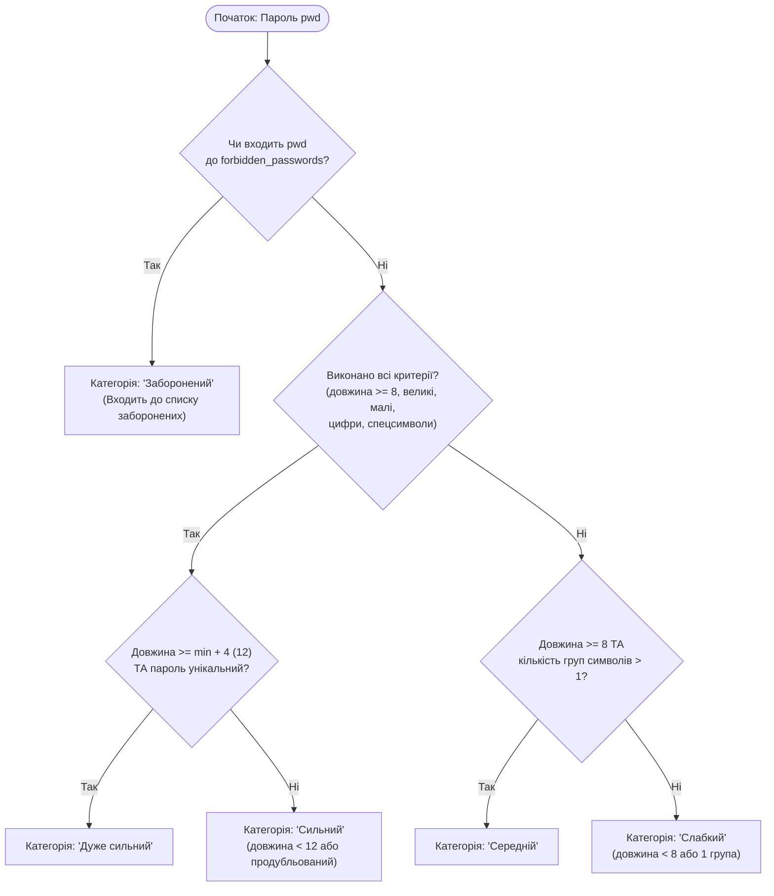
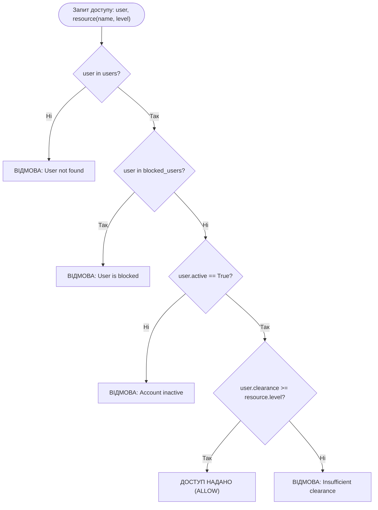
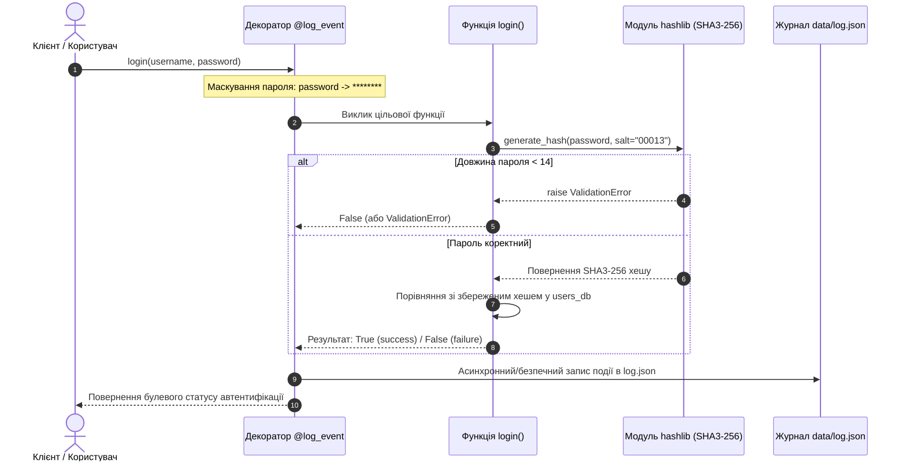

# Лабораторна робота №1: Основи розробки на Python, Git та стандарти стилю коду

- **Студент:** Кулиняк Сергій Тарасович
- **Група:** КБ-201
- **Варіант:** 13 (SHA3-256, персональна сіль `00013`, мін. довжина пароля 14)
- **Репозиторій GitHub:** [cybersecurity--python-labs](https://github.com/DresscodeCasual/cybersecurity--python-labs)
- **Коміт реалізації:** `8f8cf00`

---

## 🎯 Мета роботи

1. **Опанування базового інструментарію розробника:**
   - Робота з розподіленою системою контролю версій Git та віддаленою платформою GitHub.
   - Створення та ізоляція середовищ виконання за допомогою модуля `venv`.
   - Забезпечення гігієни репозиторію через налаштування правил `.gitignore`.
2. **Модульна архітектура та стандартизація коду:**
   - Побудова структури проекту за принципом DRY (*Don't Repeat Yourself*) із винесенням спільних конфігурацій та персональних даних у пакет `shared/` (`student.py`).
   - Суворе дотримання рекомендацій стандарту PEP-8 за допомогою швидкого статичного аналізатора та форматера коду `Ruff`.
3. **Практичне застосування базових конструкцій Python для задач кібербезпеки:**
   - Робота з різними типами колекцій: динамічні списки (`list`), незмінні кортежі (`tuple`), асоціативні словники (`dict`) та множини швидкого пошуку (`set`).
   - Криптографічне хешування паролів за алгоритмом `SHA3-256` із застосуванням унікальної персональної солі (`hashlib`).
   - Створення власних ієрархій винятків (`ValidationError`) та реалізація принципу безпечного завершення (*Fail-Secure*).
   - Автоматизація безпекового аудиту та логування спроб входу у форматі JSON за допомогою функціональних декораторів (`@log_event`) із санітизацією чутливих аргументів.

---

## 📁 Структура файлів Лабораторної роботи №1

```text
cybersecurity-python-labs/
├── .gitignore                  # Виключення системних файлів, кешу та venv
├── requirements.txt            # Залежності проекту (Ruff)
├── shared/                     # Спільні ресурси для всіх лабораторних робіт
│   ├── __init__.py             # Маркер ініціалізації пакета
│   └── student.py              # Персональні дані студента (ПІБ, група, варіант 13)
└── labs/
    └── lab01/
        ├── __init__.py         # Маркер ініціалізації пакета ЛР №1
        ├── main.py             # Головна точка входу для комплексного запуску
        ├── task1.py            # Завдання 1: Комплексний аналізатор надійності паролів
        ├── task2.py            # Завдання 2: Багаторівнева система контролю доступу
        ├── task3.py            # Завдання 3: Хешування (SHA3-256), CSV-база та JSON-аудит
        ├── README.md           # Повна документація до Лабораторної роботи №1
        └── data/               # Динамічно згенеровані файли сховища та аудиту
            ├── users.csv       # База облікових записів (логіни та SHA3-256 хеші)
            └── log.json        # Журнал подій автентифікації із маскуванням паролів
```

---

## 🚀 Встановлення залежностей та запуск

### 1. Активація віртуального середовища

Використовується віртуальне середовище з кореня репозиторію:

```bash
# Перехід у корінь репозиторію cybersecurity-python-labs
cd /home/serg/cybersecurity-python-labs

# Створення (за потреби) та активація venv
python3 -m venv venv
source venv/bin/activate

# Встановлення лінтера Ruff
pip install -r requirements.txt
```

### 2. Комплексний запуск усіх завдань Лабораторної роботи №1

Виконання повного демонстраційного сценарію через модуль `main.py`:

```bash
python -m labs.lab01.main
```

або прямий виклик:

```bash
python labs/lab01/main.py
```

### 3. Окремий запуск кожного завдання

Кожен модуль спроєктований як автономний скрипт і підтримує незалежне виконання:

```bash
# Завдання 1: Аналізатор надійності паролів
python labs/lab01/task1.py

# Завдання 2: Багаторівнева система контролю доступу
python labs/lab01/task2.py

# Завдання 3: Безпечне хешування, CSV-база та аудит
python labs/lab01/task3.py
```

---

## 🛠️ Опис завдань, критерії варіанту 13 та обробка помилок

### Завдання 1: Комплексний аналізатор надійності паролів (`task1.py`)
- **Вхідний набір паролів (10 шт.):** `["Compli4nc3@Check", "weak", "Risk@Ass3ssment", "guest", "Vulner4bility@Scan", "temp", "P3netration@Test", "demo", "S3curity@Audit", "trial"]`.
- **Критерії безпеки:** мінімальна довжина `min_length = 8`, обов'язкова наявність цифр, великих і малих літер, а також спецсимволів (`not c.isalnum()`).
- **Список заборонених паролів:** `{"guest", "temp", "demo", "trial", "password"}`. Слово `'weak'` навмисно вилучено зі списку заборонених слів, що дозволяє протестувати алгоритм оцінки категорії *«Слабкий»*.
- **Моделювання повторного використання (*Password Reuse*):** за допомогою функції `random.sample()` обираються 3 випадкові індекси зі списку (крім індексу 1, де знаходиться `'weak'`). Вибрані паролі дублюються в кінці списку.
- **Підрахунок унікальності:** агрегація повторів реалізована через `collections.Counter(passwords)`. Паролі, що відповідають усім критеріям безпеки та мають довжину $\ge 12$ (`min_length + 4`), але були продубльовані, знижують рейтинг із *«Дуже сильний»* до *«Сильний»*.
- **Підсумкова класифікація:** гарантовано відображає *рівно один слабкий пароль* (`weak`), чотири заборонені паролі, а також сильні та дуже сильні комбінації.

### Завдання 2: Багаторівнева система контролю доступу (`task2.py`)
- **Модель облікових записів (`users`):** структура словника словників, де кожен запис містить роль, підрозділ, статус активності `active: bool` та числовий рівень допуску `clearance` ($1..4$).
- **Шкала категорій безпеки (`security_levels`):** незмінний кортеж назв рівнів конфіденційності:
  1. `Open Source` (Рівень 1)
  2. `Internal Research` (Рівень 2)
  3. `Proprietary` (Рівень 3)
  4. `Trade Secret` (Рівень 4)
- **Список заблокованих сутностей (`blocked_users`):** хеш-множина `set` (`training_bot`, `model_theft`, `data_poisoning_acc`) для перевірки блокування зі складністю $O(1)$.
- **Алгоритм перевірки доступу (`check_access`):**
  1. Якщо користувач відсутній у базі `users` $\rightarrow$ відмова `DENY (User not found)`.
  2. Якщо логін міститься у множині `blocked_users` $\rightarrow$ відмова `DENY (User is blocked)`.
  3. Якщо прапорець `active == False` $\rightarrow$ відмова `DENY (Account inactive)`.
  4. Якщо рівень допуску `clearance >= resource_level` $\rightarrow$ доступ надано `ALLOW`, інакше $\rightarrow$ відмова `DENY (Insufficient clearance)`.

### Завдання 3: Безпечне хешування, CSV-база та JSON-аудит (`task3.py`)
- **Криптографічний алгоритм:** `SHA3-256` (`hashlib.sha3_256`).
- **Персональна сіль:** рядок `"00013"` (формується динамічно з варіанта: `f"{VARIANT_NUMBER:05d}"`).
- **Мінімальна довжина пароля:** `14` символів.
- **Власний клас винятку `ValidationError`:** генерується у разі передачі пароля, коротшого за 14 символів.
- **Збереження бази облікових записів (`create_users`):** збереження 10 користувачів у файл `labs/lab01/data/users.csv` із заголовком `username,password_hash`.
- **Безпечний аудит через декоратор `@log_event`:** перехоплює виклики функції `login()`, маскує паролі символами `********` у списках `args` та словниках `kwargs`, фіксує статус (`success`/`failure`), ім'я користувача, винятки та часову мітку в `labs/lab01/data/log.json`.
- **Принцип Fail-Secure:** утиліта коректно перехоплює та локалізує винятки `ValidationError`, `ValueError`, `FileNotFoundError`, `PermissionError`, `OSError`, унеможливлюючи витік внутрішніх стек-трейсів і відмовляючи в доступі при будь-яких аномаліях.

---

## 🧩 Архітектура та алгоритми виконання (Mermaid-діаграми)

### 1. Алгоритм оцінки стійкості пароля (Завдання 1)



### 2. Багаторівневий контроль доступу (Завдання 2)



### 3. Процес автентифікації та безпечного логування (Завдання 3)



---

## 🔍 Зразки вхідних даних та результатів виконання (Варіант 13)

### 1. Результати роботи Завдання 1 (Таблиця оцінки надійності)

```text
[+] Результати комплексного аналізу надійності:
+----+----------------------+---------+------------+----------------+----------------------------------------------------+
| №  | Пароль               | Довжина | Унікальний | Оцінка         | Примітка                                           |
+----+----------------------+---------+------------+----------------+----------------------------------------------------+
| 1  | Compli4nc3@Check     |   16    |    Так     | Дуже сильний   | Всі критерії виконано, довжина >= min+4, унікальний |
| 2  | weak                 |    4    |    Так     | Слабкий        | Довжина менша за min_length (4 < 8) або лише 1 група |
| 3  | Risk@Ass3ssment      |   15    |    Так     | Дуже сильний   | Всі критерії виконано, довжина >= min+4, унікальний |
| 4  | guest                |    5    |  Ні (x2)   | Заборонений    | Входить до списку заборонених паролів              |
| 5  | Vulner4bility@Scan   |   18    |    Так     | Дуже сильний   | Всі критерії виконано, довжина >= min+4, унікальний |
| 6  | temp                 |    4    |  Ні (x2)   | Заборонений    | Входить до списку заборонених паролів              |
| 7  | P3netration@Test     |   16    |    Так     | Дуже сильний   | Всі критерії виконано, довжина >= min+4, унікальний |
| 8  | demo                 |    4    |  Ні (x2)   | Заборонений    | Входить до списку заборонених паролів              |
| 9  | S3curity@Audit       |   14    |    Так     | Дуже сильний   | Всі критерії виконано, довжина >= min+4, унікальний |
| 10 | trial                |    5    |    Так     | Заборонений    | Входить до списку заборонених паролів              |
+----+----------------------+---------+------------+----------------+----------------------------------------------------+
```

### 2. Результати перевірки доступу Завдання 2 (Фрагмент матриці доступу)

```text
---> Перевірка для користувача: 'ai_security_expert' (clearance: 4, active: True)
user=ai_security_expert resource=ai_models -> ALLOW
user=ai_security_expert resource=training_datasets -> ALLOW
user=ai_security_expert resource=model_artifacts -> ALLOW
user=ai_security_expert resource=synthetic_data -> ALLOW

---> Перевірка для користувача: 'training_bot' (clearance: 1, active: False, in blocked_users)
user=training_bot resource=ai_models -> DENY (User is blocked)
user=training_bot resource=training_datasets -> DENY (User is blocked)
user=training_bot resource=synthetic_data -> DENY (User is blocked)

[+] Демонстрація крайових випадків:
  [Користувач відсутній у базі users] user=unknown_intruder resource=ai_models -> DENY (User not found)
```

### 3. Вміст бази користувачів (`labs/lab01/data/users.csv`)

```csv
username,password_hash
ai_sec_lead,64bb2d9f450b822ef919ab4ae8302ce13267bc160659d80c781e52f647a179b7
ml_researcher,6103ba1b545551bbb1e016cebb9e6b0c6783596f2cd10aeaa7aadefb19f282ec
pipeline_admin,890f81534134ccdcc4ff565a971ebf67aba10fe4fff649537ba1bb1fe25c4ec4
soc_analyst,9e459023b2e62608f9e9711ae33b28b7c89f8dbd04a5a057732c09802b7c7af2
devsecops_eng,754c976044e52993a0bd534f59475c8dbbd3361c4d09dfe969f7d436e4358302
model_auditor,74eaa592c2fb086aba6a0d7cd037a074b4569a5fa3a4b6d0a2102dc250a45463
cloud_architect,6516513d0be0cdcc9a0afd7ded7e324c1478d6432312fbdc941c2212b51b21d8
compliance_mgr,7202ae6b329b6a0875b42a02207614c48096bec8c05c75f96bbe6189ebd4e3b7
crypto_expert,992e1841a925b9ac6f18f781abd4b6840642839d573cd34bfb528c14258ed97e
incident_resp,fc0abf554017ba091f110b3d782631d59cfd266fe63cca9504d5528343ecee5b
```

### 4. Зразок записів журналу аудиту (`labs/lab01/data/log.json`)

```json
[
    {
        "event": "login",
        "user": "ai_sec_lead",
        "result": "success",
        "timestamp": "2026-09-24 09:29:49",
        "args": [
            "ai_sec_lead",
            "********"
        ],
        "kwargs": {
            "users_db": "<users_db: 10 users>",
            "salt": "00013"
        }
    },
    {
        "event": "login",
        "user": "ai_sec_lead",
        "result": "failure",
        "timestamp": "2026-09-24 09:29:49",
        "args": [
            "ai_sec_lead",
            "********"
        ],
        "kwargs": {
            "users_db": "<users_db: 10 users>",
            "salt": "00013"
        }
    }
]
```

---

## 🛡️ Контроль якості коду (Ruff PEP-8)

Перевірка коду лінтером і форматером Ruff виконується з активованого віртуального середовища:

```bash
# Статичний аналіз коду на відповідність стандартам PEP-8
./venv/bin/ruff check labs/lab01/

# Перевірка правил форматування
./venv/bin/ruff format --check labs/lab01/
```

Результат виконання перевірки:

```text
All checks passed!
5 files already formatted
```

---

## ❓ Відповіді на контрольні питання (Захист роботи)

1. **Про ізоляцію залежностей (`virtualenv`): Чому професійні розробники наполягають на використанні віртуальних середовищ навіть для найменших проектів? Що може піти не так у вашій операційній системі, якщо ви інсталюватимете всі пакети глобально через `pip install`?**
   - Глобальне встановлення пакетів призводить до конфліктів версій залежностей (*Dependency Hell*) між різними проектами. Крім того, в сучасних дистрибутивах Linux (Ubuntu, Debian, Fedora) системні інструменти (менеджери пакетів, мережеві служби, графічний інтерфейс) самі написані на Python. Перезапис їхніх системних бібліотек сторонніми версіями через `sudo pip install` може повністю вивести з ладу операційну систему. Віртуальне середовище ізолює дерево бібліотек під конкретний проект, гарантуючи передбачуваність та стабільність.

2. **Про гігієну репозиторію та `.gitignore`: Уявіть, що ви випадково завантажили папку `.venv/` або файл `users.csv` із реальними паролями на GitHub. Чому це вважається критичним інцидентом безпеки?**
   - Папка `.venv/` містить сотні мегабайтів скомпільованих бінарних файлів, прив'язаних до конкретної платформи розробника, які засмічують історію Git і не працюватимуть на іншій машині.
   - Потрапляння файлу `users.csv` або конфігураційних секретів у відкритий репозиторій є критичним інцидентом витоку облікових даних (*Credential Leakage*). Зловмисники сканують публічні коміти автоматизованими ботами протягом кількох секунд після завантаження, і навіть наступне видалення файлу не стирає його з історії Git.

3. **Списки (`list`), Кортежі (`tuple`) та Множини (`set`): Чому для заблокованих користувачів використовується саме множина (`set`)? Яка різниця у швидкості пошуку елемента (`x in collection`) між списком та множиною, якщо база користувачів зросте до мільйона записів? Чому `security_levels` логічно зробити саме незмінним кортежем (`tuple`)?**
   - Множина `set` реалізована на базі хеш-таблиці, тому середня складність перевірки наявності елемента (`x in blocked_users`) становить $O(1)$ (константний час). У списку `list` пошук є лінійним $O(n)$, що для 1 000 000 записів вимагатиме до 1 000 000 операцій порівняння.
   - Кортеж `security_levels` є незмінною колекцією (`immutable`). Це унеможливлює випадкову або зловмисну зміну градації рівнів допуску під час роботи програми та забезпечує захист від побічних ефектів.

4. **Словники (`dict`): У Завданні 2 інформація про користувачів представлена у вигляді словника словників (`users`), де ключем є логін. Які переваги дає така структура в порівнянні зі списком? Як отримати значення департаменту конкретного користувача, не використовуючи цикл, і що станеться при зверненні через `users[key]` проти `.get()`?**
   - Словник забезпечує миттєвий прямий доступ до запису користувача за унікальним логіном за час $O(1)$ без необхідності ітераційного перебору списку.
   - Отримати підрозділ без циклу можна прямим зверненням: `dept = users.get(user_login, {}).get("department")`.
   - Звернення `users[key]` при відсутності ключа призводить до аварійного завершення програми через виняток `KeyError`. Метод `users.get(key, default)` повертає значення за замовчуванням (або `None`), що гарантує відмовостійкість.

5. **Про автоматизацію якості коду (Ruff проти ручного контролю): Якщо ваш код працює абсолютно коректно та виконує всі завдання, чому лінтер Ruff все одно може видати попередження? Чи може «погано відформатований, але робочий» код приховувати реальні вразливості безпеки?**
   - Робочий код не обов'язково є якісним і безпечним. «Погано відформатований» код часто приховує серйозні проблеми: некоректне перехоплення глобального винятку `except Exception:`, незакриті файлові дескриптори, невикористані імпорти чи змінні, випадкові витоки областей видимості або заплутану логіку умов, у якій легко припуститися помилки розмежування доступу. Ruff виявляє ці патерни статично, гарантуючи надійність.

6. **Про унікальність та повторне використання паролів (Завдання 1): Під час оцінки надійності ви штучно дублювали паролі. Чому повторне використання одного й того самого пароля на різних ресурсах є однією з головних проблем сучасної кібербезпеки?**
   - При повторному використанні пароля (*Password Reuse*) компрометація одного стороннього, слабко захищеного сервісу автоматично призводить до компрометації всіх інших облікових записів користувача (робоча пошта, банківські додатки, VPN-шлюзи компанії) через автоматизовану атаку підстановки облікових даних (*Credential Stuffing*).

7. **Про незворотність: Хешування проти Шифрування (Завдання 3): Чому для збереження паролів у файлі `users.csv` ми використовуємо саме одностороннє хешування, а не симетричне шифрування (наприклад, AES)? У чому різниця між цими концепціями з точки зору зловмисника, який викрав базу даних?**
   - Хешування є **односторонньою незворотною** математичною функцією: із хешу принципово неможливо відновити первинний відкритий пароль. Шифрування є **двостороннім оборотним** процесом, що спирається на секретний ключ. Якщо зловмисник викраде зашифровану базу та заволодіє ключем, він миттєво розшифрує всі паролі у відкритому вигляді. У разі ж викрадення якісно хешованої та засоленої бази відновити вихідні паролі практично неможливо.

8. **Про криптографічну сіль (`salt`): Яку роль відіграє сіль у безпечному збереженні паролів? Як використання унікальної солі захищає базу користувачів від атак із використанням веселкових таблиць (*Rainbow Tables*)?**
   - Криптографічна сіль — це додаткова послідовність символів, що конкатенується з паролем перед хешуванням (`hash(password + salt)`). Вона робить неможливим використання заздалегідь обчислених словників та веселкових таблиць (*Rainbow Tables*). Завдяки солі два користувачі з абсолютно ідентичними паролями матимуть абсолютно різні значення хешів у базі даних, змушуючи атакуючого зламувати кожен пароль індивідуально.

9. **Про переваги використання декораторів (Декоратор `@log_event`): Чому логування спроб авторизації було винесено саме в декоратор, а не реалізовано всередині самої функції `login()`? Які архітектурні переваги це дає?**
   - Застосовано принцип єдиної відповідальності (*Single Responsibility Principle*). Функція `login()` відповідає виключно за бізнес-логіку перевірки пароля, тоді як декоратор інкапсулює безпековий аудит, санітизацію аргументів та запис у файл. Це дозволяє повторно використовувати аудит для будь-яких інших функцій системи без дублювання коду та без модифікації їхньої внутрішньої реалізації.

10. **Про безпечну обробку помилок (*Fail-Secure*): Чому важливо перехоплювати конкретні винятки (`FileNotFoundError`, `ValidationError`), а не писати загальний блок `except Exception:`? Як детальний вивід системного трасування помилки (*Traceback*) на екран користувача може допомогти зловмиснику?**
    - Загальний перехоплювач `except Exception:` «маскує» критичні помилки програми (наприклад, опечатки в назвах змінних, збої пам'яті), ускладнюючи налагодження.
    - Вивід системного *Traceback* кінцевому користувачеві розкриває внутрішню структуру системи: абсолютні шляхи до файлів, назви бібліотек, версії компонентів та номери збійних рядків. Зловмисник використовує цю інформацію для підбору цільових експлойтів. Концепція *Fail-Secure* вимагає логувати деталі у закритий журнал, а користувачеві повертати нейтральне повідомлення про помилку з безпечним станом відмови.

11. **Про повторне використання коду та модуль `student.py`: Чому модульний підхід та принцип DRY (*Don't Repeat Yourself*) є фундаментальними не лише для зручності розробника, а й для безпеки програмного забезпечення?**
    - Дублювання коду призводить до розбіжностей під час оновлення: виправивши вразливість або змінивши налаштування в одному місці, розробник може забути про копії в інших файлах. Централізований модуль конфігурацій забезпечує єдине джерело істини (*Single Source of Truth*), мінімізує людський фактор і полегшує проходження безпекового аудиту.

---

## 📚 Відповіді на контрольні запитання до Лекції №1 («Основи розробки на Python, Git та стандарти стилю коду»)

1. **Що таке розподілена система контролю версій (DVCS) і в чому полягає її перевага над централізованими системами (наприклад, SVN)?**
   - У розподіленій системі (Git) кожен розробник має на своєму локальному комп'ютері повну копію всього репозиторію разом з усією історією комітів, гілок та тегів. На відміну від централізованих систем, розробник може фіксувати зміни, переглядати історію та створювати гілки автономно без постійного підключення до центрального сервера. У разі виходу з ладу віддаленого сервера будь-яка локальна копія може бути використана для повного відновлення проекту.

2. **Які три основні стани файлів існують в архітектурі Git?**
   - *Working Directory (Робоча директорія):* файли на диску, в яких безпосередньо вносяться зміни розробником.
   - *Staging Area / Index (Область індексації):* проміжний буфер, куди файли додаються командою `git add` для підготовки до фіксації.
   - *Repository / Git Directory (`.git`):* база даних об'єктів Git, де збережені зафіксовані коміти (`git commit`), що гарантує збереження історії.

3. **У чому полягає різниця між командами `git add`, `git commit` та `git push`?**
   - `git add <file>` переносить змінені файли з робочої директорії до області індексації (*Staging Area*).
   - `git commit -m "..."` фіксує проіндексовані зміни в локальній базі даних Git у вигляді нового незмінного знімка стану (*commit*) з метаданими (автор, час, повідомлення).
   - `git push <remote> <branch>` завантажує локальні коміти на віддалений сервер (наприклад, GitHub) для синхронізації з іншими учасниками команди.

4. **Для чого призначений файл `.gitignore`? Які типові патерни файлів обов'язково повинні бути включені до нього в Python-проектах?**
   - Файл `.gitignore` визначає шаблони імен файлів та каталогів, які Git повинен ігнорувати і не відстежувати.
   - До обов'язкових патернів належать:
     - Каталоги віртуальних середовищ: `venv/`, `.venv/`, `env/`.
     - Байт-код і кеш інтерпретатора: `__pycache__/`, `*.py[cod]`.
     - Кеш інструментів тестування та лінтингу: `.ruff_cache/`, `.pytest_cache/`.
     - Конфіденційні дані та локальні конфігурації: `.env`, секретні ключі, локальні дампи баз даних.

5. **Що таке стандарт PEP 8 і чому дотримання конвенцій стилю є критично важливим для командної розробки?**
   - PEP 8 (*Python Enhancement Proposal 8*) — це офіційний посібник зі стилю написання коду для мови Python. Він регламентує правила відступів (4 пробіли), максимальну довжину рядка, правила іменування змінних, функцій і класів (`snake_case` для функцій і змінних, `PascalCase` для класів), розміщення імпортів та пробілів. Єдиний стиль усуває когнітивне навантаження при читанні чужого коду, спрощує рецензування (*Code Review*) та запобігає виникненню беззмістовних диффів у системі контролю версій.

6. **Чим сучасний лінтер `Ruff` відрізняється від традиційних інструментів Python (таких як Flake8, Black, isort, Pylint)?**
   - `Ruff` написаний на мові Rust і працює у 10–100 разів швидше за традиційні інструменти на Python. Крім надзвичайної швидкодії, він є інструментом «все-в-одному»: замінює собою одночасно лінтер (Flake8), форматер коду (Black), сортувальник імпортів (isort) та інструменти перевірки docstrings і складних патернів, значно спрощуючи конфігурацію проекту.

7. **Як працює інтерпретатор Python під час запуску файлу скрипта? Що таке байт-код та навіщо створюється папка `__pycache__`?**
   - Інтерпретатор Python (CPython) спочатку виконує лексичний і синтаксичний аналіз вихідного тексту `.py` та компілює його у проміжне низькорівневе представлення — *байт-код* (bytecode). Потім віртуальна машина Python (PVM) послідовно виконує інструкції цього байт-коду.
   - Скомпільований байт-код зберігається у файлах з розширенням `.pyc` всередині папки `__pycache__`. Це дозволяє уникнути повторної компіляції вихідного коду при наступних запусках програми, якщо вихідний файл не зазнав змін, прискорюючи час старту програми.

8. **У чому полягає різниця між динамічною сильною типізацією Python та статичною типізацією в таких мовах, як C/C++ або Java?**
   - *Динамічна типізація:* типи асоціюються зі значеннями (об'єктами) в оперативній пам'яті під час виконання програми (*runtime*), а не зі змінними під час компіляції. Змінна є лише посиланням на об'єкт і може змінювати свій тип у процесі роботи.
   - *Сильна (строга) типізація:* Python не виконує неявних автоматичних перетворень між несумісними типами даних (наприклад, вираз `"10" + 5` викличе виняток `TypeError`, а не сконвертує число в рядок автоматично, як у JavaScript).

9. **Що визначає конструкція `if __name__ == "__main__":` у файлах модулів Python?**
   - Змінна `__name__` є спеціальним вбудованим атрибутом модуля. Якщо модуль запускається безпосередньо як головна програма (наприклад, `python task1.py`), інтерпретатор встановлює значення `__name__ = "__main__"`. Якщо ж файл імпортується іншим модулем (наприклад, `import task1`), то `__name__` дорівнює імені файлу модуля (`"task1"`). Ця конструкція дозволяє відокремити виконуваний демонстраційний код від коду, що імпортується як бібліотека.

10. **Що таке `sys.path` і яким чином інтерпретатор здійснює пошук модулів при виконанні інструкції `import`?**
    - `sys.path` — це список рядків, що містить каталоги, в яких інтерпретатор шукає модулі при імпорті. Пошук здійснюється послідовно:
      1. Поточний каталог, з якого запущено скрипт (або поточна робоча директорія).
      2. Шляхи зі змінної оточення `PYTHONPATH` (якщо задана).
      3. Стандартні системні бібліотеки Python.
      4. Каталоги сторонніх встановлених пакетів (`site-packages` віртуального середовища).
    - Додавання кореня проекту до `sys.path` у верхній частині файлів дозволяє безпомилково імпортувати внутрішні модулі проекту (`shared`, `labs.lab01`) незалежно від поточної директорії терміналу.
