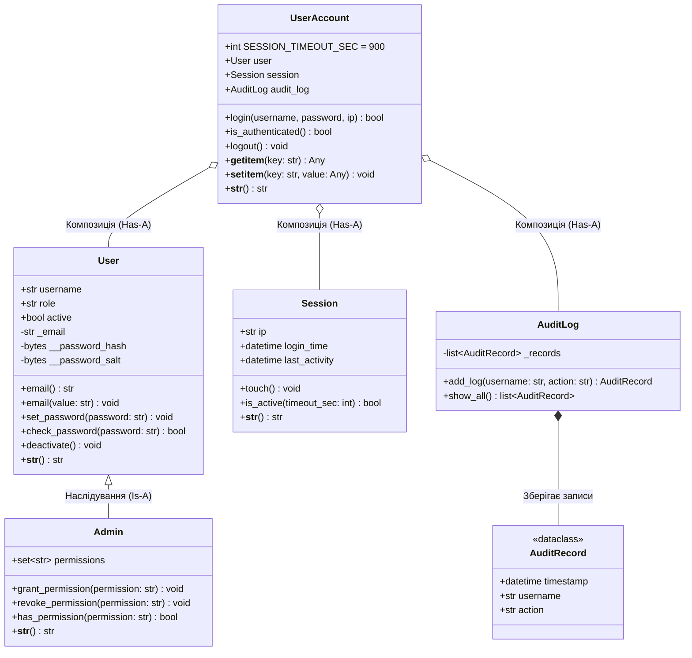

# Лабораторна робота №2: Розробка консольних утиліт для задач кібербезпеки

- **Студент:** Кулиняк Сергій Тарасович
- **Група:** КБ-201
- **Варіант:** 13 (Сканер витоків конфіденційних даних / PII Exfiltration Scanner)

---

## 🎯 Мета роботи

1. **Поглиблення знань з об'єктно-орієнтованого програмування (ООП) в Python:** практичне застосування інкапсуляції, наслідування (Admin Is-A User), композиції (UserAccount Has-A User/Session/AuditLog), декораторів `@property`, `@dataclass` та магічних методів `__getitem__`, `__setitem__`, `__str__`.
2. **Опанування інструментів стандартної бібліотеки:**
   - `pathlib.Path` — безпечна та кросплатформна робота зі шляхами та рекурсивний пошук файлів.
   - `re` — валідація адрес електронної пошти та регулярні вирази для детектування конфіденційних даних (PII).
   - `datetime` та `timezone` — безпечна робота з часовими мітками в UTC та контроль таймаутів сесій.
   - `collections.Counter` — швидка агрегація кількості знайдених категорій вразливих даних.
   - `hashlib` та `hmac` — безпечне хешування паролів за стандартом PBKDF2-HMAC-SHA256 з персональною сіллю та захистом від атак за часом (`hmac.compare_digest`).
   - `logging` та `argparse` — побудова стійких консольних CLI-утиліт зі структурованим виведенням та гнучким керуванням параметрами.
3. **Забезпечення високої якості коду:** суворе дотримання PEP-8 за допомогою сучасного лінтера та форматера `Ruff`.

---

## 📁 Структура файлів Лабораторної роботи №2

```text
labs/lab02/
├── __init__.py
├── main.py                     # Головна точка входу з підкомандами `demo` та `analyze`
├── task1.py                    # Завдання 1: ООП-модель облікового запису та сесій
├── task2.py                    # Завдання 2: CLI-сканер витоків конфіденційних даних (PII)
├── README.md                   # Детальна документація до ЛР №2
└── data/                       # Тестові вхідні дані та збережені звіти
    ├── pii_scan_summary.json   # Згенерований аудиторський звіт (санітизований)
    └── data_v13/               # Каталог вхідних файлів Варіанта 13 (з lab2_data.zip)
        └── scan/
            ├── clean.txt                 # Текстовий файл без конфіденційних даних
            ├── exports/
            │   └── export.json           # JSON-дамп з email, IP, телефонами та картками
            ├── logs/
            │   └── app.log               # Журнал додатку з несанкціонованим логуванням PII
            └── notes/
                └── users.txt             # Текстові нотатки з незахищеними картками, IP та телефонами
```

---

## 🚀 Встановлення залежностей та запуск

### 1. Активація віртуального середовища

Використовується єдине віртуальне середовище з кореня репозиторію:

```bash
# З кореня репозиторію cybersecurity-python-labs
source venv/bin/activate
pip install -r requirements.txt
```

### 2. Запуск демонстрації Завдання 1 (ООП: Модель облікового запису)

Запуск демонстраційного сценарію Завдання 1 через команду `demo` головного модуля:

```bash
python -m labs.lab02.main demo
```

Або прямий запуск файлу модуля:

```bash
python labs/lab02/task1.py
```

### 3. Запуск консольної утиліти Завдання 2 (PII Scanner)

Запуск через підкоманду `analyze` модуля `main.py` або безпосередньо `task2.py`:

```bash
# 1. Базовий запуск сканування каталогу за замовчуванням з маскуванням чутливих даних у JSON:
python -m labs.lab02.main analyze --mask

# 2. Фільтрація тільки за банківськими картками:
python -m labs.lab02.main analyze --patterns cards --mask

# 3. Фільтрація тільки за email-адресами:
python -m labs.lab02.main analyze --patterns emails --mask

# 4. Прямий запуск task2.py з довідкою:
python labs/lab02/task2.py --help

# 5. Сканування довільного каталогу зі збереженням звіту:
python labs/lab02/task2.py --scan-dir labs/lab02/data/data_v13/scan --patterns all --mask --out-json labs/lab02/data/pii_scan_summary.json
```

### 4. Комплексний запуск обох завдань

```bash
python -m labs.lab02.main
```

---

## 🛠️ Опис параметрів командного рядка (CLI) та обробка помилок

Консольна утиліта підтримує такі аргументи (`argparse`):

| Аргумент | Тип | За замовчуванням | Опис |
| :--- | :--- | :--- | :--- |
| `--scan-dir` | `Path` | `labs/lab02/data/data_v13/scan` | Шлях до каталогу для рекурсивного сканування файлів |
| `--patterns` | `str` (`all`, `cards`, `emails`) | `all` | Категорія конфіденційних даних для детектування |
| `--mask` | прапорець | `False` | Маскувати чутливі персональні дані у збереженому JSON-звіті |
| `--out-json` | `Path` | `labs/lab02/data/pii_scan_summary.json` | Шлях збереження підсумкового аудиторського звіту |
| `--log-level` | `str` (`DEBUG`, `INFO`, `WARNING`, `ERROR`) | `INFO` | Рівень деталізації подій логування |

### Обробка винятків та стійкість до помилок:
- **`FileNotFoundError` / `NotADirectoryError`:** Якщо передано неіснуючий або некоректний шлях до каталогу сканування, утиліта логує зрозуміле повідомлення про помилку через `logger.error` та безпечно завершує роботу з кодом `1`.
- **`OSError` / Помилки кодування:** Під час читання текстових файлів використовується захищена конструкція з параметром `errors="ignore"`, що запобігає падінню програми при зустрічі з бінарними або нестандартними кодуваннями.
- **`KeyError` / `TypeError`:** Клас `UserAccount` валідує типи значень при спробі запису через `__setitem__` та блокує доступ до приватних полів (хеш і сіль пароля), викидаючи відповідні винятки.
- **`ValueError`:** Валідатор `@email.setter` відхиляє некоректні email-адреси, а конструктор сесії відхиляє непозитивний таймаут `timeout_sec <= 0`.

---

## 🧩 Архітектура Завдання 1: Схема взаємодії класів



---

## 🔍 Зразки вхідних даних та результатів сканування (Варіант 13)

### Вхідні файли (`labs/lab02/data/data_v13/scan/`):
- `clean.txt`: 0 витоків PII.
- `notes/users.txt`: контакти, номери телефонів, внутрішній IP, банківська карта (формат через пробіли `5555 5555 5555 4444`).
- `exports/export.json`: дамп записів з `carol@example.test`, IP `203.0.113.80`, `dave@example.test`, телефон `+44 20 7946 0958`, карта `4000-0000-0000-0002`.
- `logs/app.log`: журнал з витоком `alice@example.test`, IP `192.0.2.10`, телефон `+380 67 123 45 67`, карта `4111-1111-1111-1111`, зворотний IP `198.51.100.44`.

### Результати роботи сканера в консолі:
```text
[INFO] Scanning directory /home/serg/cybersecurity-python-labs/labs/lab02/data/data_v13/scan for unmasked PII data...
[INFO] Scanned 4 files.
=== Detected Sensitive Data (PII) ===
Email Addresses     : 4 matches
Credit Card Numbers : 3 matches
Phone Numbers       : 4 matches
IPv4 Addresses      : 4 matches
=== Sample Findings (Masked for Display) ===
[PII FOUND] File: labs/lab02/data/data_v13/scan/exports/export.json (Line 4)
  Email Addresses   : c****l@example.test
[PII FOUND] File: labs/lab02/data/data_v13/scan/exports/export.json (Line 5)
  IPv4 Addresses    : 203.0.113.***
[PII FOUND] File: labs/lab02/data/data_v13/scan/exports/export.json (Line 8)
  Email Addresses   : d****e@example.test
[PII FOUND] File: labs/lab02/data/data_v13/scan/exports/export.json (Line 9)
  Phone Numbers     : +44 20***-**58
[PII FOUND] File: labs/lab02/data/data_v13/scan/exports/export.json (Line 12)
  Credit Card Numbers: 4000-****-****-0002
[PII FOUND] File: labs/lab02/data/data_v13/scan/logs/app.log (Line 1)
  Email Addresses   : a****e@example.test
[WARNING] Unmasked PII found in plaintext logs!
[INFO] Sanitized report saved to /home/serg/cybersecurity-python-labs/labs/lab02/data/pii_scan_summary.json
```

### Пояснення виявлених аномалій:
1. **Витік відкритих номерів платіжних карт (PCI DSS Violation):** Утиліта виявила 3 номери кредитних карт у відкритому вигляді у трьох різних файлах (`app.log`, `export.json`, `users.txt`). Зберігання таких даних без токенізації та шифрування суперечить вимогам стандарту PCI DSS.
2. **Витік персональних контактних даних (PII Exfiltration Risk):** Знайдено 4 адреси електронної пошти та 4 номери телефонів у відкритому тексті, що може бути використано зловмисниками для цільового фішингу (Spear Phishing) або соціальної інженерії.
3. **Розкриття внутрішньої мережевої топології:** Знайдено 4 IP-адреси (зокрема локальний `10.20.30.40` та публічні адреси зворотного зв'язку), що полегшує рекогностування інфраструктури для зловмисника.

---

## 🛡️ Контроль якості коду (Ruff PEP-8)

Перевірка лінтером та форматером Ruff виконується з кореня репозиторію:

```bash
# Статичний аналіз
ruff check labs/lab02/

# Перевірка форматування
ruff format --check labs/lab02/
```

Результат виконання перевірки:
```text
All checks passed!
4 files already formatted
```

---

## ❓ Відповіді на контрольні питання (Захист роботи)

1. **Як в Python реалізована інкапсуляція? Чим відрізняються атрибути `_password_hash` (protected) та `__password_hash` (private)? Що таке Name Mangling?**
   - В Python інкапсуляція базується на конвенціях і механізмі трансформації імен (*name mangling*), а не на жорсткому обмеженні доступу компілятором.
   - Один символ підкреслення (`_protected`) — це угода про внутрішнє використання, інтерпретатор ніяк не змінює ім'я і не блокує доступ ззовні.
   - Два символи підкреслення (`__private`) активують механізм **Name Mangling**: інтерпретатор перейменовує атрибут на `_ClassName__private` (наприклад, `_User__password_hash`). Це захищає атрибут від випадкового перезапису в нащадках та ускладнює прямий несанкціонований доступ ззовні.

2. **Яку перевагу надає використання декоратора `@property` для атрибута `email` у порівнянні з явним викликом методів `get_email()` та `set_email()`?**
   - `@property` дозволяє звертатися до атрибута через звичний синтаксис поля (`user.email = "..."`, `print(user.email)`), забезпечуючи при цьому прозору валідацію та контроль логіки запису через геттер і сеттер без потреби змінювати публічний інтерфейс класу при рефакторингу.

3. **У Завданні 1 клас `Admin` успадковує `User`, а клас `UserAccount` містить об'єкти `User` та `Session`. Чому обрано саме такі архітектурні рішення (принцип "Is-A" проти "Has-A")?**
   - Принцип **"Is-A" (є різновидом)**: Адміністратор *є* користувачем (`Admin` успадковує `User`), оскільки він володіє всіма властивостями користувача (ім'я, пароль, email, статус) та розширює їх додатковими правами.
   - Принцип **"Has-A" (має у своєму складі)**: Обліковий запис *не є* сесією і *не є* користувачем, він *має* посилання на користувача, поточну сесію та журнал аудиту (`UserAccount` агрегує `User`, `Session`, `AuditLog`). Композиція забезпечує слабку зв'язаність (*loose coupling*), дозволяючи змінювати стан сесії або логер без модифікації сутності користувача.

4. **Для чого реалізуються спеціальні методи `__getitem__` та `__setitem__`? Як це змінює інтерфейс взаємодії з об'єктом класу `UserAccount`?**
   - Ці методи реалізують інтерфейс індексації/відображення (`account["key"]` та `account["key"] = value`). Це робить взаємодію з об'єктом схожою на словник, дозволяючи впровадити строгий контроль дозволених ключів, динамічну валідацію типів (`TypeError`) та повністю заборонити розкриття критичних криптографічних секретів (`KeyError`).

5. **Які рутинні методи (`__init__`, `__repr__`, `__eq__`) автоматично генерує декоратор `@dataclass`? У яких випадках доцільніше використати `@dataclass` замість звичайного класу або словника?**
   - `@dataclass` автоматично генерує конструктор `__init__`, зручне строкове представлення `__repr__`, метод порівняння значень `__eq__` (за значеннями полів), а за потреби `__hash__` та оператори порівняння.
   - `@dataclass` ідеально підходить для DTO (Data Transfer Objects), таких як `AuditRecord` чи `PIIMatch`: на відміну від словника, датаклас забезпечує типізацію, автодоповнення в IDE та захист від друкарських помилок у назвах полів; на відміну від звичайного класу, він позбавляє від необхідності писати одноманітний шаблонний код.

6. **Чому модуль `pathlib` вважається більш сучасним та безпечним інструментом для роботи зі шляхами, ніж традиційний `os.path` або робота зі звичайними рядками?**
   - `pathlib` використовує об'єктно-орієнтований підхід (`Path`), надає зручний оператор `/` для конкатенації шляхів, абстрагує системні відмінності роздільників (`/` в POSIX та `\` в Windows), запобігає вразливостям обходу директорій (*Path Traversal*) завдяки методам `resolve()` та коректно обробляє симлінки та відносні шляхи.

7. **Які переваги дає використання `collections.Counter` та `collections.defaultdict` при аналізі великих лог-файлів?**
   - `Counter` оптимізований на рівні C-реалізації для підрахунку частотності подій (O(1) на додавання), автоматично ініціалізує нулем нові ключі та має вбудований метод `most_common()`.
   - `defaultdict` уникає зайвих перевірок `if key not in dict` або викликів `dict.setdefault()`, що істотно прискорює агрегацію даних та робить код чистим і захищеним від помилок відсутності ключів (`KeyError`).

8. **Як у модулі `argparse` реалізується додавання обов'язкових та позиційних аргументів, прапорців (flags) та типів даних? Чому валідацію типів аргументів варто робити на рівні `argparse`?**
   - Позиційні аргументи додаються без дефісів (`parser.add_argument("command")`), іменовані — з дефісами (`--scan-dir`), прапорці — через `action="store_true"`, типи — через параметр `type` (наприклад `type=Path`, `type=int`).
   - Валідація типів на рівні `argparse` виконується до запуску основної бізнес-логіки. При некоректному значенні `argparse` автоматично генерує зрозуміле повідомлення про помилку та виводить підказку користувачеві без аварійного завершення зі стек-трейсом.

9. **Чим використання модуля `logging` краще за звичайні виклики `print()` у консольних утилітах кібербезпеки? Яку роль відіграють рівні логування (`DEBUG`, `INFO`, `WARNING`, `ERROR`, `CRITICAL`)?**
   - `logging` дозволяє налаштовувати рівні деталізації виведення без зміни коду (наприклад, прапорцем `--log-level`), направляти логи одночасно в консоль і в захищений файл або SIEM-систему, автоматично додавати часові мітки та рівні критичності.
   - Рівні градації сигналізують про серйозність події: `DEBUG` — для відладки, `INFO` — хід нормального виконання, `WARNING` — виявлення потенційних загроз безпеки (наприклад, незамаскованих PII), `ERROR` — помилки доступу до ресурсів, `CRITICAL` — збій системи.

10. **Які категорії помилок (наприклад, невикористані імпорти, складність функцій, помилки стилю) виявив аналізатор Ruff у вашому коді і як ви їх усунули?**
    - Було виявлено:
      - `I001`: невідсортовані або незгруповані імпорти — усунено автоматичним форматуванням імпортів згідно з PEP-8.
      - `SIM103`: зайве розгалуження `if/else` для повернення булевого значення — спрощено до прямого виразу `return self.session.is_active(...)`.
      - `F541`: зайвий префікс `f` у рядку без підстановок — виправлено на звичайний рядковий літерал.
      - `BLE001`: перехоплення загального винятку `Exception` — звужено до конкретних типів помилок `(OSError, ValueError, RuntimeError)`.
      - `F401`: невикористаний імпорт — видалено.
      - `LOG015`: виклик `logging.error()` на кореневому логері — замінено на використання іменованого логера модуля `logger.error()`.

---

## 📚 Відповіді на контрольні запитання до Лекції №2 («Основи мови Python: типи даних і керування виконанням програми»)

1. **Що таке інструкція та вираз у Python? Наведіть по одному прикладу.**
   - *Інструкція (statement)* — це синтаксична одиниця мови, яка задає певну закінчену дію: присвоєння змінній (`attempts = 5`), імпорт модуля (`import re`), виклик функції (`print(...)`), умовний перехід (`if ...:`).
   - *Вираз (expression)* — це фрагмент коду, який обчислюється інтерпретатором та повертає конкретне значення: `2 + 3` (дає `5`), `failed_attempts > 3` (дає булеве значення `True`/`False`), `f"User: {name}"`.

2. **Для чого потрібні відступи в блоках if і циклів? Що рекомендує PEP 8?**
   - Відступи в Python позначають межі та рівні вкладеності блоків коду (тіла умов, циклів, функцій, класів). Відступ синтаксично визначає, які саме інструкції виконуються всередині конструкції.
   - PEP 8 суворо рекомендує використовувати **4 пробіли** на один рівень відступу, не змішувати табуляцію з пробілами та розділяти логічні блоки програми порожніми рядками.

3. **Чим присвоєння `=` відрізняється від порівняння `==`?**
   - Оператор `=` — це оператор зв'язування/присвоєння, який посилає ім'я змінної зліва на об'єкт/результат виразу справа (`attempts = 3`).
   - Оператор `==` — це оператор порівняння рівності значень двох операндів, який повертає булеве значення `True` або `False` (`attempts == 3`).

4. **Які значення представляють типи int, float, bool, str та NoneType?**
   - `int`: цілі числа довільної точності (наприклад, `0`, `-5`, `100`, лічильники подій, порти).
   - `float`: дійсні числа з плаваючою крапкою подвійної точності IEEE 754 (наприклад, `0.75`, `3.14`).
   - `bool`: логічні значення істинності (`True` або `False`).
   - `str`: незмінні послідовності символів Unicode (текст, рядки, шляхи, IP-адреси).
   - `NoneType`: єдине значення `None`, що позначає відсутність або невизначеність значення.

5. **Що повернуть 7 / 2, 7 // 2, 7 % 2 і -7 // 2?**
   - `7 / 2` поверне `3.5` (звичайне ділення завжди повертає `float`).
   - `7 // 2` поверне `3` (ділення з округленням донизу до найближчого меншого цілого).
   - `7 % 2` поверне `1` (остача від цілочисельного ділення).
   - `-7 // 2` поверне `-4` (округлення у бік мінус нескінченності: `-3.5` округлюється до `-4`).

6. **Чому перевірка `0.1 + 0.2 == 0.3` може не дати очікуваного результату?**
   - Числа `float` у комп'ютері зберігаються у двійковому форматі з фіксованою розрядністю. Дроби `0.1` та `0.2` не мають точного скінченного двійкового представлення і перетворюються на нескінченні періодичні дроби, тому `0.1 + 0.2` дає `0.30000000000000004`, що не дорівнює `0.3`. Для точних фінансових або критичних розрахунків використовують модуль `decimal.Decimal` або функцію `math.isclose()`.

7. **Чим відрізняються and, or і not? Коли виконується другий операнд у виразі з and?**
   - `and`: логічне «І», істинне лише якщо обидва операнди істинні.
   - `or`: логічне «АБО», істинне якщо хоча б один операнд істинний.
   - `not`: логічне заперечення («НІ»), інвертує булеве значення.
   - В Python реалізовано *коротке замикання (short-circuit evaluation)*: другий операнд у виразі `a and b` обчислюється **лише тоді**, коли перший операнд `a` є істинним (`True`). Якщо `a` є хибним (`False`), результат виразу гарантовано хибний, і другий операнд взагалі не оцінюється.

8. **Чому `bool("False")` дорівнює `True`?**
   - Функція `bool()` оцінює об'єкт на порожність/істинність. Будь-який непорожній рядок в Python має булеве значення `True`. Текст рядка не аналізується як ключове слово. Тільки порожній рядок `bool("")` повертає `False`.

9. **Чи змінює метод `strip()` вихідний рядок? Поясніть на прикладі.**
   - Ні, метод `strip()` не змінює вихідний рядок, оскільки рядки в Python є незмінними (*immutable*). Він повертає **новий** об'єкт рядка з видаленими пробільними символами на краях:
     ```python
     raw = "  admin  "
     cleaned = raw.strip()
     print(raw)  # "  admin  " (без змін)
     print(cleaned)  # "admin" (новий рядок)
     ```

10. **Що повертає `input()` і навіщо використовують `int()` під час обробки введеного числа?**
    - `input()` завжди повертає значення типу `str` (рядок), навіть якщо користувач ввів лише цифри (наприклад, `"42"`).
    - Для використання введеного значення в арифметичних операціях, порівняннях з числами або лічильниках рядок необхідно явно перетворити на ціле число за допомогою конструктора `int()`, інакше операції типу `"42" + 1` призведуть до помилки `TypeError`.

11. **У якому порядку перевіряються гілки `if`, `elif`, `else`?**
    - Гілки перевіряються суворо послідовно **згори вниз**. Як тільки перша умова (`if` або черговий `elif`) виявляється істинною (`True`), виконується відповідний блок інструкцій, а всі наступні гілки `elif` та блок `else` пропускаються. Блок `else` виконується лише тоді, коли жодна з попередніх умов не виявилася істинною.

12. **Чим перебір елементів циклом `for` відрізняється від циклу `while`?**
    - Цикл `for` призначений для ітерації по скінченній колекції або ітерованому об'єкту (список, кортеж, рядок, словник, об'єкт `range`). Він автоматично бере наступний елемент і завершується, коли елементи вичерпано.
    - Цикл `while` виконує блок інструкцій повторно доти, доки задана логічна умова залишається істинною (`True`). Він використовується, коли точна кількість повторень заздалегідь невідома, і потребує зміни змінних усередині тіла циклу для уникнення зациклення.

13. **Які числа утворює `range(2, 8, 2)` і чи входить 8 до результату?**
    - `range(start=2, stop=8, step=2)` генерує послідовність чисел: `2, 4, 6`.
    - Число `8` **не входить** до результату, оскільки права межа (`stop`) в Python інтерпретується як відкритий інтервал і ніколи не включається в послідовність.

14. **Чим `break` відрізняється від `continue`? На який цикл діє `break` у вкладених циклах?**
    - `break` повністю та достроково перериває виконання всього поточного циклу й передає керування наступній інструкції після блоку циклу.
    - `continue` перериває лише **поточну ітерацію** циклу, пропускає залишок тіла циклу та негайно переходить до перевірки умови/наступного елемента.
    - У вкладених циклах оператор `break` перериває **лише найближчий внутрішній цикл**, у якому він розташований; зовнішній цикл продовжує виконання.

15. **Що надрукує такий код і чому?**
    ```python
    values = [0, 2, 5]
    for value in values:
        if value == 2:
            continue
        print(value)
    ```
    - Код надрукує:
      ```text
      0
      5
      ```
    - **Пояснення:** На першій ітерації `value = 0` (умова `0 == 2` хибна) — друкується `0`. На другій ітерації `value = 2` (умова `2 == 2` істинна) — викликається `continue`, рядок `print(value)` пропускається, і цикл негайно переходить до третього елемента. На третій ітерації `value = 5` — друкується `5`.
